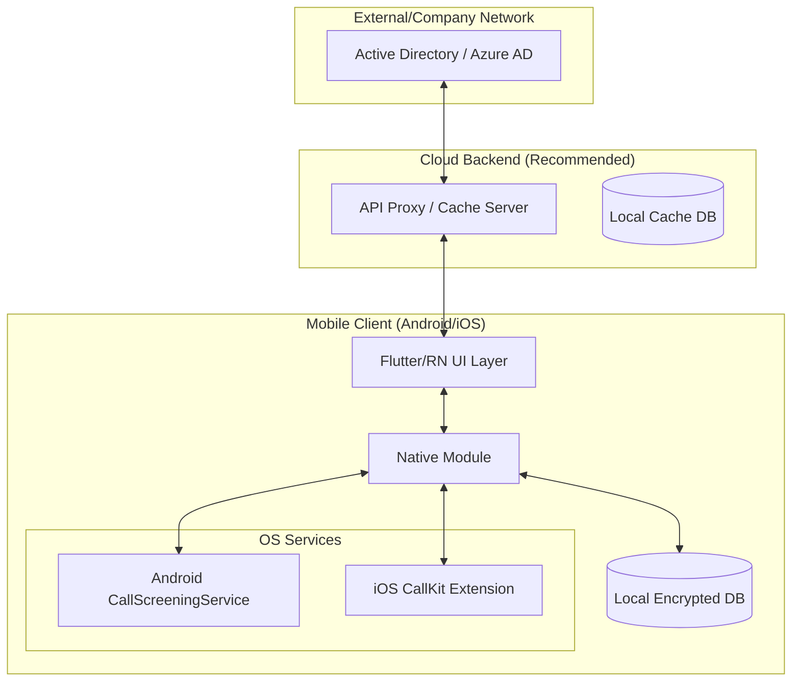

# Enterprise Caller ID (업무용 발신자 정보 표시) 앱 구현 계획

회사의 Active Directory(AD) 서버와 연동하여 실시간으로 직원 정보를 확인하고, 전화 수신 시 발신자 정보를 표시하는 크로스 플랫폼 앱 구현 상세 계획입니다.

## 1. 시스템 아키텍처 (System Architecture)

전체 시스템은 **Mobile Client**, **Backend Proxy**, **Active Directory** 세 레이어로 구성됩니다.

### 왜 Backend Proxy가 필요한가요?
- **성능**: AD(LDAP/Graph API) 직접 쿼리는 느릴 수 있습니다. 모바일의 5초 제한(Android) 내에 응답하기 위해 최적화된 캐시 서버가 필요합니다.
- **보안**: AD 서버를 직접 외부에 노출하지 않고 인증(OAuth 2.0) 및 필터링을 수행합니다.

---

## 2. 플랫폼별 상세 구현 스펙 (Development Specs)

### A. Android 구현: `CallScreeningService`
- **핵심 API**: `android.telecom.CallScreeningService`
- **구현 방식**:
  1. `ROLE_CALL_SCREENING` 권한을 사용자에게 요청합니다.
  2. 전화 수신 시 `onScreenCall` 콜백이 트리거됩니다 (최대 5초 이내 응답 필수).
  3. 로컬 DB 또는 서버 API를 통해 번호를 조회합니다.
  4. `respondToCall`을 통해 발신자 정보를 시스템 UI에 오버레이하거나 차단/허용을 결정합니다.
- **장점**: 실시간 서버 조회가 비교적 용이합니다.

### B. iOS 구현: `CallKit` (Call Directory Extension)
- **핵심 API**: `CXCallDirectoryExtension`
- **구현 방식**:
  1. iOS는 보안상 전화 수신 시 실시간 네트워크 조회가 매우 제한적입니다. (iOS 18+ Live Caller ID Lookup이 있으나 구현이 까다롭습니다.)
  2. **추천 방식 (Static Sync)**: 앱이 백그라운드에서 주기적으로 서버와 동기화하여 수만 건의 직원 번호를 `CXCallDirectoryExtension`의 로컬 DB(SQLite)에 미리 로드합니다.
  3. 시스템이 전화 수신 시 이 로컬 DB를 참조하여 "홍길동 대리(마케팅팀)"을 표시합니다.
- **장점**: 네트워크 연결이 없어도 작동하며, 배터리 소모가 적습니다.

---

## 3. 기능별 개발 단계 (Development Phases)

### Phase 1: 기반 구축 및 Backend 연동
- **Auth**: Microsoft Authentication Library (MSAL)를 통한 Azure AD 로그인.
- **Sync Engine**: Microsoft Graph API를 사용하여 직원 연락처 정보를 가져오는 로직 구현.
- **Search**: 앱 내에서 이름/부서/번호로 직원을 찾고 바로 전화를 거는 기능.

### Phase 2: Android Native 모듈 개발
- `CallScreeningService` 구현.
- `RoleManager`를 통한 권한 획득 흐름 개발.
- 수신 시 팝업 UI (System Overlay) 설계.

### Phase 3: iOS Native 모듈 개발
- `CXCallDirectoryHandler` 구현.
- App Group을 통한 메인 앱과 Extension 간 데이터 공유.
- 백그라운드 fetch 세팅 (Background Mode 설정).

---

## 4. 보안 및 데이터 관리 (Security)

- **암호화**: 기기에 저장되는 연락처 정보는 `SQLCipher` 등을 이용해 DB 수준에서 암호화합니다.
- **개인정보 보호**: 동기화된 데이터는 앱 삭제 시 즉시 파기되도록 설계하며, 퇴사자 처리 시 서버 API 응답에 따라 로컬 데이터를 삭제합니다.
- **최소 권한**: 연락처 수정 권한은 필요하지 않으며, 전화를 식별할 수 있는 권한만 요청합니다.

## User Review Required

> [!IMPORTANT]
> **iOS의 실시간성 한계**: iOS의 표준 `CallKit`은 오프라인 DB 방식이 기본입니다. 수천~수만 명의 데이터는 미리 기기에 내려받아두어야 합니다. '완전 실시간'을 원하신다면 iOS 18 이상의 새로운 프레임워크를 검토해야 하나, 이는 서버 인프라(PIR 서버 등) 구축 비용이 매우 높습니다. 

> [!WARNING]
> **권한 승인 거절**: 안드로이드와 iOS 모두 사용자가 '스팸 방지 및 발신자 ID' 설정을 수동으로 켜야 합니다. 이를 가이드하는 UX 설계가 매우 중요합니다.

## Open Questions

1. **사용 중인 AD 종류**: Azure AD(클라우드)인가요, 아니면 On-premise Active Directory인가요?
2. **대상 인원 규모**: 회사 임직원 수가 대략 어느 정도인가요? (동기화 방식 결정에 중요)
3. **선호 프레임워크**: Flutter, React Native, 또는 순수 네이티브(Swift/Kotlin) 중 선호하는 것이 있으신가요?

---

## Verification Plan

### Automated Tests
- `MockCallScreeningService` 테스트: 전화 수신 이벤트를 가상으로 발생시켜 DB 조회 성능 측정 (5초 제한 확인).
- `MockCallDirectory` 테스트: 데이터 로드 속도 측정.

### Manual Verification
- 실제 안드로이드/아이폰 기기에 앱 설치 후, 연락처에 없는 사내 전화번호로 전화를 걸어 발신자 정보가 정상 표시되는지 확인.
- Backend에서 정보 수정 후, 기기 동기화 버튼 클릭 시 정보가 업데이트되는지 확인.
