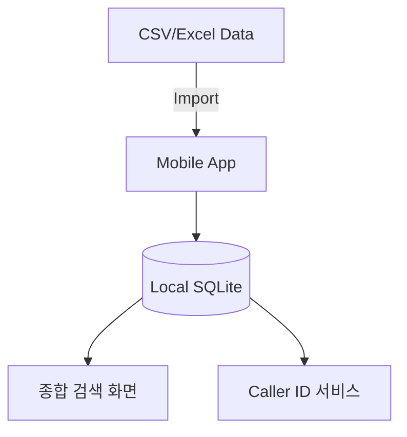

# Enterprise Caller ID 앱 구현 계획 (v0.1)

본 계획서는 초기 단계의 복잡도를 낮추기 위해 **"1,000명의 엑셀(CSV) 연락처 데이터"**를 기반으로 한 로컬 동작 위주의 개발 계획입니다.

## 1. 초기 개발 아키텍처 (Simplified v0.1)

### 아키텍처 핵심 변화
- **Backend 제거**: 초기 단계에서는 복잡한 서버 연동 없이 앱 내부에 데이터를 포함하거나 엑셀 파일을 읽어오는 방식으로 개발합니다.
- **오프라인 우선**: 데이터가 기기에 상주하므로 네트워크 없이도 즉시 발신자 식별이 가능합니다.

---

## 2. v0.1 주요 기능 (MVP)

### A. 데이터 임포트 및 초기화
- 1,000명의 이름, 부서, 전화번호가 담긴 CSV 파일을 앱 실행 시 로컬 SQLite DB로 마이그레이션합니다.

### B. 통합 검색 UI
- 초성 검색 가능 (예: 'ㅎㄱㄷ' -> '홍길동')
- 부서별 필터링 기능
- 검색 결과에서 바로 전화 걸기 기능

### C. 기본 발신자 표시 (핵심)
- **Android**: `CallScreeningService`에서 로컬 SQLite를 쿼리하여 정보 표시.
- **iOS**: 1,000개의 데이터를 `CXCallDirectoryExtension`에 일괄 등록.

---

## 3. 개발 단계 및 확장 계획

1. **v0.1 (현재)**: 고정된 데이터(CSV) 기반의 로컬 동작 확인.
2. **v0.2**: 앱 내에서 CSV 파일을 최신본으로 업로드(파일 선택기) 기능 추가.
3. **v1.0 (최종)**: Active Directory(AD) 실시간 동기화 및 관리자 대시보드 연동.

---

## 4. 사용자 준비 사항 (v0.1)
- 1,000명의 정보를 담은 엑셀 시트 (이름, 전화번호, 부서, 직급 포함).
- 테스트용 안드로이드/아이폰 실기기.
