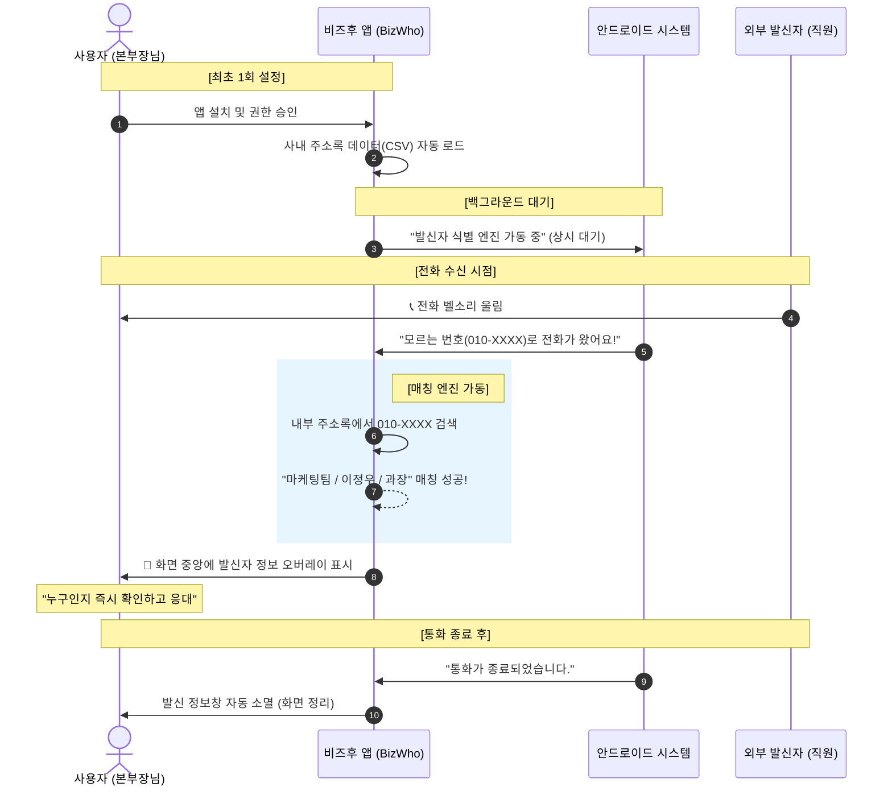

# 📱 비즈후(BizWho) 서비스 프로세스 안내 (본부장님 보고용)

본 다이어그램은 사내 임직원 연락처 정보를 기반으로 한 발신자 식별 서비스의 전체 흐름을 시각화한 것입니다.

## 1. 서비스 흐름도 (Sequence Diagram)

## 2. 본부장님께 드리는 3줄 요약

1.  **자동화**: 임직원 데이터를 한 번만 넣어두면, 앱을 켜지 않아도 **24시간 자동**으로 작동합니다.
2.  **직관성**: 모르는 번호도 전화가 오는 즉시 **[부서 / 성함 / 직급]**을 카드 형태로 보여주어 당황하지 않고 전화를 받으실 수 있습니다.
3.  **철저한 보안**: 모든 데이터 대조는 스마트폰 내부에서만 이루어지며, 외부 서버로 임직원 정보가 유출되지 않도록 설계되었습니다.

---
> [!TIP]
> **폴더블 폰(Z Flip) 특화**: 본부장님께서 폴더블 폰을 사용하신다면, 폰을 접어두었다가 펼쳐서 전화를 받으실 때도 정보창이 화면 크기에 맞춰 자동으로 다시 나타나도록 최적화되어 있습니다.
